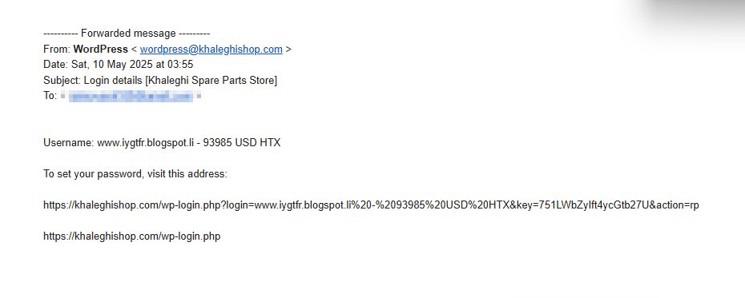

🔍 Key Phishing Indicators from Your Analysis
1. Suspicious Sender
Displayed as: wordpress@khaleghishop.com

Email impersonates: WordPress login alert, possibly for a business/store.

Mismatch: “wordpress” is a common service name used to build false trust.

2. Spoofed Domain
No DMARC record found for khaleghishop.com (DMARC = Domain-based Message Authentication).

SPF: Authenticated ✅ but not aligned ❌.

DKIM: Not authenticated ❌ and not aligned ❌.

These failures mean the email can be spoofed without being rejected by many servers.

3. Suspicious URLs
URL embedded in email:

arduino
Copy
Edit
https://khaleghishop.com/wp-login.php?login=www.iygtfr.blogspot.li...
Appears to use a real-looking domain but hides iygtfr.blogspot.li inside the query string — very suspicious.

Link tries to mimic a login page to phish credentials.

4. Threat Language
Subject: “Login details” → creates urgency.

Email contains no official branding or company details.

5. Header Hop Trace (MXToolbox)
Mail relayed through maillii.org and centraldnserver.com, both unknown and suspicious hosts.

One of the relays (sregw88.maillii.org) is blacklisted ❌.

6. Grammar & Structure
Generic message body, no personalized greeting.

Contains odd strings like “93985 USD HTX” and a Blogger link in the username — looks autogenerated or malicious.
